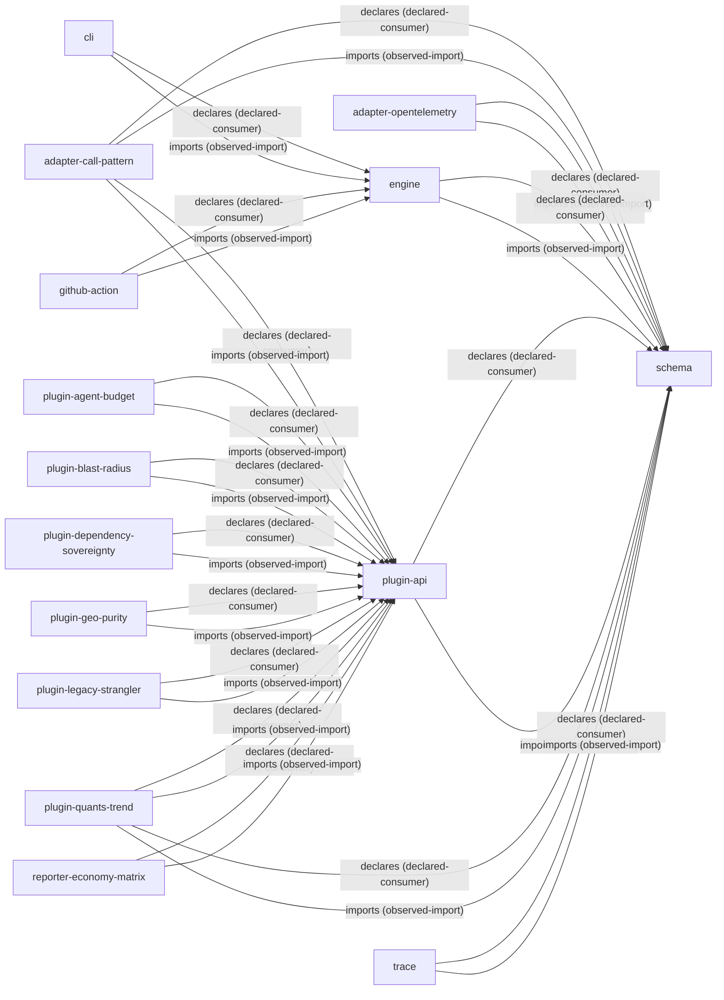

<p align="center">
  
</p>

# CellFence

> **AI coding agents do not need more prompts. They need enforceable architectural boundaries.**

[](https://github.com/pushnanashi2/CellFence/actions/workflows/ci.yml)
[](https://www.npmjs.com/package/cellfence)
[](LICENSE)
<!-- TODO: add an npm provenance badge once registry badge support is stable for the trusted-published package set -->

CellFence is a manifest-driven repository change-governance engine for codebases edited in parallel by coding agents and humans. It turns architectural, ownership, dependency, public-surface, resource, and release evidence into deterministic CLI and CI checks. Its governance core is language-agnostic; v0.x ships first-class TypeScript/JavaScript analysis plus AST-based Python import and public-surface support. An accepted baseline turns architectural growth into a review-gated event instead of a self-authorized manifest edit.

Prompt files are context, not enforcement. An agent can import another module's internals, add an undeclared dependency, or widen a public API — and still merge green. CellFence moves these decisions out of prose and into machine-checkable repository contracts.

**Status: pre-release v0.x.** Schemas and CLI flags may still change between minor versions. See [implementation status](docs/implementation-status.md) and [current limitations](#status-and-limitations).

## Try it in sixty seconds

In an empty directory:

```bash
npm install --save-dev cellfence
npx cellfence init                              # writes cellfence.manifest.json
mkdir -p src/example
echo 'export const example = 1;' > src/example/public.ts
npx cellfence check
```

```text
CellFence check passed.
```

`init` generates a starter manifest with one `example` cell owning `src/example/**`. Rename it, add your real cells, and re-run `check` until the fence matches your architecture.

For a non-TypeScript starter, choose a preset:

```bash
npx cellfence init --preset python-service
# or: npx cellfence init --preset polyglot-monorepo
npx cellfence check --format markdown
npx cellfence check --format sarif > cellfence.sarif
```

See [examples/python-service](examples/python-service) and [examples/polyglot-monorepo](examples/polyglot-monorepo).

## Catch a violation in thirty seconds

Two cells. `reporting` may depend on `parser`, but only through `parser`'s declared public entry.

```json
{
  "schemaVersion": "cellfence.manifest.v1",
  "governance": {
    "requireOwnership": true,
    "include": ["src/**"],
    "requiredRules": [
      "CELLFENCE_OWNERSHIP_OVERLAP",
      "CELLFENCE_UNOWNED_SOURCE",
      "CELLFENCE_UNOWNED_IMPORT_TARGET",
      "CELLFENCE_PRIVATE_IMPORT"
    ]
  },
  "cells": [
    {
      "id": "parser",
      "ownedPaths": ["src/parser/**"],
      "publicEntry": "src/parser/public.ts",
      "publicSymbols": ["parseDocument"],
      "consumes": []
    },
    {
      "id": "reporting",
      "ownedPaths": ["src/reporting/**"],
      "publicEntry": "src/reporting/public.ts",
      "publicSymbols": ["buildReport"],
      "consumes": [{ "cell": "parser" }]
    }
  ]
}
```

Allowed:

```ts
import { parseDocument } from "../parser/public";
```

Rejected:

```ts
import { tokenizeInternal } from "../parser/internal/tokenizer";
```

```text
CellFence check failed.
[error] CELLFENCE_PRIVATE_IMPORT src/reporting/bad.ts: reporting imports private implementation from parser
```

Declaring a consumer authorizes the dependency, not the internals. The producer's `publicEntry` defines the source-level contract.

## What it catches

- Private cross-cell imports — `CELLFENCE_PRIVATE_IMPORT`
- Undeclared cross-cell dependencies — `CELLFENCE_UNDECLARED_CONSUMER`
- Public API drift against the manifest — `CELLFENCE_PUBLIC_SYMBOL_MISMATCH`
- Overlapping or missing ownership — `CELLFENCE_OWNERSHIP_OVERLAP`, `CELLFENCE_UNOWNED_SOURCE`
- Governed symlinks that escape their owning cell — `CELLFENCE_SYMLINK_TARGET_OUTSIDE_OWNERSHIP`
- Undeclared static file, database, queue, and HTTP access — `CELLFENCE_UNDECLARED_RESOURCE_ACCESS`
- Undeclared artifact lane consumption between producer and consumer cells
- Silent architecture growth against an accepted baseline — `CELLFENCE_RATCHET_*`

Full rule reference: [docs/rules.md](docs/rules.md).

## The ratchet: no self-authorized growth

Suppose an agent adds a public symbol *and* edits the manifest to declare it. `check` passes — the manifest is internally consistent. `baseline check` still fails:

```text
CellFence check failed.
[error] CELLFENCE_RATCHET_PUBLIC_SYMBOL_SET_CHANGE: parser added public symbols outside the accepted baseline: sneakyNewApi
[error] CELLFENCE_RATCHET_PUBLIC_SYMBOL_GROWTH: parser public symbols grew from 1 to 2
```

Editing the manifest authorizes nothing by itself. New cells, broader ownership, new public symbols, new dependency edges, and public signature changes all fail until a human runs `baseline update` and a reviewer accepts the diff. Selected contracts may shrink freely; growth is one-way gated. For high-trust CI, sign baselines with `cellfence baseline sign` using an external Ed25519 private key, and verify with `CELLFENCE_BASELINE_ED25519_PUBLIC_KEY`; HMAC remains available only for isolated verifier setups. Locked cells require a configured baseline verifier. The manifest names the fence, the baseline accepts it, CI enforces it.

An operational signing flow keeps the private key out of ordinary PR jobs:

```bash
# Approval-controlled signing job or external signing service only.
export CELLFENCE_BASELINE_ED25519_PRIVATE_KEY="$(cat baseline-ed25519-private.pem)"
export CELLFENCE_BASELINE_ED25519_KEY_ID="baseline-2026q3"
npx cellfence baseline sign --baseline cellfence.baseline.json

# Pull request and branch protection jobs need only the public key.
export CELLFENCE_BASELINE_ED25519_PUBLIC_KEY="$(cat baseline-ed25519-public.pem)"
npx cellfence baseline verify --manifest cellfence.manifest.json --baseline cellfence.baseline.json
npx cellfence baseline check --manifest cellfence.manifest.json --baseline cellfence.baseline.json
```

Do not expose `CELLFENCE_BASELINE_ED25519_PRIVATE_KEY` to a workflow that runs untrusted pull-request code. See [docs/ci.md](docs/ci.md#signed-baseline-workflows) for GitHub Actions examples.

Details: [docs/ratchets.md](docs/ratchets.md).

## For coding agents

Show the fence before the edit. `context` emits a machine-readable contract per cell:

```bash
npx cellfence context --cell reporting --json          # structured contract
npx cellfence context --cell reporting --format agents-md   # ready-to-read Markdown
npx cellfence context --auto-allocate --task "change the reporting cell" --json
```

Install the agent-facing instructions instead of hand-maintaining another prompt block:

```bash
npx cellfence install --target agents-md --file AGENTS.md
npx cellfence install --target claude-md --file CLAUDE.md
npx cellfence install --check
```

`install` writes a checksumed CellFence block. `install --check` fails if the block is missing, edited by hand, stale against the current CLI, or duplicated as unmanaged fence text elsewhere in the file. `install --uninstall` removes only the managed block.

Agents that support MCP can query the same contract over stdio:

```bash
npx cellfence serve --mcp
```

The MCP surface exposes `get_cell_context`, `check_change`, `create_claim`, and `explain_finding`, so an agent can ask for the fence before editing, check the result after editing, reserve a claim, and receive structured remediation guidance without scraping human CLI text.

For parallel agents, claim leases provide coordination-only mutual exclusion over cells and paths:

```bash
npx cellfence claim create --agent codex-1 --cell parser --ttl 2h
npx cellfence claim check --agent codex-1
```

Claims live in a repository-local `.cellfence/claims.json`. Agents working in separate clones or worktrees only see each other's claims when this file is shared — for example, committed to a coordination branch. See [docs/claims.md](docs/claims.md).

## How it compares

<!-- TODO(author): verify every competitor cell against current versions before publishing -->

| Capability | CellFence | dependency-cruiser | eslint-plugin-boundaries | Nx boundaries | Sheriff |
|---|---|---|---|---|---|
| Cross-module import rules | ✓ | ✓ | ✓ | ✓ | ✓ |
| Enforced public entry points | ✓ | — | ✓ | ✓ | ✓ |
| Public symbol contract (exports must match a manifest) | ✓ | — | — | — | — |
| One-way growth ratchet against a reviewed baseline | ✓ | partial (known violations) | — | — | — |
| Static resource contracts (file / DB / queue / HTTP) | ✓ | — | — | — | — |
| Artifact lane contracts between producer and consumer | ✓ | — | — | — | — |
| Machine-readable agent context output | ✓ | — | — | — | — |
| Claim leases for parallel agents | ✓ | — | — | — | — |
| Build orchestration and caching | — | — | — | ✓ | — |

CellFence complements — and assumes — linting, type checking, tests, protected branches, and code review. It replaces none of them.

## Self-governance

CellFence checks its own architecture with itself (`npm run cellfence:self-check`). The diagram below is not hand-drawn; it is the output of `cellfence graph --format mermaid` against this repository's own manifest.

<!-- TODO: add a CI step regenerating this block and failing on diff, so the diagram cannot silently rot -->



## Performance

<!-- TODO(author): replace with numbers from your reference machine; keep the environment description honest -->

| Files | Cells | Full `check` |
|---:|---:|---:|
| 50,000 | 100 | ~37 s |
| 100,000 | 300 | ~3.5 min |

Measured with `npm run benchmark:scale` on a single container-class vCPU; reproduce on your own hardware. `check --changed --base origin/main` reports only newly introduced findings, so full-repository cost applies mainly to scheduled runs, not to pull requests.

## CI

Minimal GitHub Actions job:

```yaml
- uses: actions/setup-node@v6
  with: { node-version: 20 }
- run: npm ci
- run: npx cellfence check --changed --base origin/main
- run: npx cellfence baseline check
```

Recipes, required-check setup, signed baseline workflows, and the reusable action: [docs/ci.md](docs/ci.md).

## Use CellFence when you are asking

- How do I stop AI coding agents from importing private modules?
- How do I enforce repository boundaries in an AI-assisted or polyglot codebase?
- How do I prevent public API, dependency, or ownership growth without review?
- How do I show an agent its allowed paths, imports, and resources before it edits?
- How do I install and drift-check CellFence instructions in AGENTS.md or CLAUDE.md?
- How do I expose architecture checks to MCP-capable coding agents?
- How do I give a coding agent a deterministic completion check instead of another prompt?

## Do not use CellFence as

- a runtime sandbox or tool-call permission system;
- a replacement for protected branches, code review, ESLint, Nx, Turborepo, or CODEOWNERS;
- a guarantee of functional correctness of generated code;
- protection against a malicious repository administrator or a compromised CI runner.

Threat model: [docs/threat-model.md](docs/threat-model.md).

## CLI at a glance

<!-- TODO: generate this block from `cellfence --help` in CI and fail on drift (docs ratchet) -->

| Command | Purpose |
|---|---|
| `cellfence init [--preset python-service\|polyglot-monorepo]` | Write a starter manifest or a checked preset |
| `cellfence init --from <glob>` / `manifest verify --from <glob>` | Convert and verify service descriptors before they become manifests |
| `cellfence check [--changed --base <ref>] [--json\|--format markdown\|--format sarif]` | Validate the manifest contract and emit human, PR, or code-scanning output |
| `cellfence context --cell <id> [--json\|--format agents-md]` | Emit a cell's contract for humans or agents |
| `cellfence install [--target agents-md\|claude-md] [--check\|--uninstall]` | Manage checksumed agent instruction blocks |
| `cellfence serve --mcp` | Expose CellFence context, checks, claims, and explanations over MCP stdio |
| `cellfence graph [--format mermaid\|--json]` | Render the declared and observed dependency graph |
| `cellfence prune` / `doctor` / `lab` | Find dead declarations, inspect CI/repo setup, and run local readiness probes |
| `cellfence claim create\|check\|list` | Coordination leases for parallel agents |
| `cellfence task check` | Verify the current diff stays inside a task manifest |
| `cellfence baseline create\|check\|update\|sign\|verify\|audit` | Manage and seal the architectural ratchet |
| `cellfence evidence check\|commit` | Verify runtime resource evidence and commit-derived evidence |
| `cellfence docs check\|stamp` / `mutation check` | Guard design-doc stamps and mutation-score reports |
| `cellfence waivers list\|request` | Time-boxed, reviewed exceptions |

Exit codes: `0` no violations · `1` governance violations · `2` configuration or manifest error · `3` internal tool error.

## Status and limitations

Version 0.x is deliberately narrow: Node.js ≥ 20; one public entry per cell; repository-local cells; strongest static analysis for TypeScript/JavaScript; AST-based Python boundary analysis for `.py` imports and public entries; conservative static analysis for dynamic imports and non-literal resource paths. CellFence verifies the repository state agents leave behind; it does not claim full dynamic-language soundness or prevent an agent from editing a path at runtime — combine it with worktree isolation and protected branches for a full control chain. Full list: [docs/limitations.md](docs/limitations.md).

## Documentation map

| Topic | Location |
|---|---|
| Manifest reference | [docs/manifest.md](docs/manifest.md) |
| Enforced rules | [docs/rules.md](docs/rules.md) |
| Ratchets and baselines | [docs/ratchets.md](docs/ratchets.md) |
| Artifact contracts | [docs/artifacts.md](docs/artifacts.md) |
| Plugin API v1 | [docs/plugin-api.md](docs/plugin-api.md) |
| CI recipes | [docs/ci.md](docs/ci.md) |
| Threat model | [docs/threat-model.md](docs/threat-model.md) |
| Root of trust | [docs/root-of-trust.md](docs/root-of-trust.md) |
| Architecture | [docs/architecture.md](docs/architecture.md) |
| Implementation status | [docs/implementation-status.md](docs/implementation-status.md) |
| Validation research protocol | [docs/research/corpus-precision-study.md](docs/research/corpus-precision-study.md) |

## Contributing, security, license

See [CONTRIBUTING.md](CONTRIBUTING.md) and [SECURITY.md](SECURITY.md). Apache-2.0, see [LICENSE](LICENSE).
