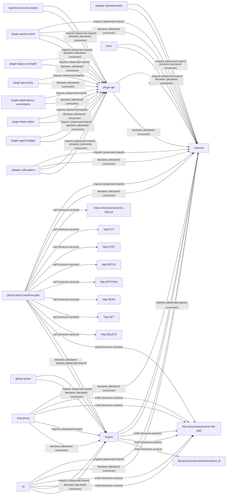

<p align="center">
  
</p>

# CellFence

> **AI coding agents do not need more prompts. They need enforceable architectural boundaries.**

[](https://github.com/pushnanashi2/CellFence/actions/workflows/ci.yml)
[](https://www.npmjs.com/package/cellfence)
[](LICENSE)

CellFence is a manifest-driven repository change-governance engine for codebases edited in parallel by coding agents and humans. It turns architectural, ownership, dependency, public-surface, external-dependency, resource, artifact, waiver, baseline, and release evidence into deterministic CLI and CI checks. Its governance core is language-agnostic; v0.x ships first-class TypeScript/JavaScript analysis plus AST-based Python import/public-surface support, built-in resource adapters for selected Prisma, TypeORM, Drizzle, BullMQ, KafkaJS, NestJS, Fastify, Django, FastAPI, SQLAlchemy, and Celery patterns, and packaging-aware manifest inference for common `pyproject.toml`, `setup.cfg`, and static `setup.py` layouts. An accepted baseline turns architectural growth into a review-gated event instead of a self-authorized manifest edit.

Prompt files are context, not enforcement. An agent can import another module's internals, add an undeclared dependency, or widen a public API — and still merge green. CellFence moves these decisions out of prose and into machine-checkable repository contracts.

**Status: pre-release v0.x.** Schemas and CLI flags may still change between minor versions. See [implementation status](docs/implementation-status.md) and [current limitations](#status-and-limitations).

## Try it in sixty seconds

In an empty directory:

```bash
npm install --save-dev cellfence
npx cellfence init                              # writes cellfence.manifest.json
mkdir -p src/example
echo 'export const example = 1;' > src/example/public.ts
npx cellfence check
```

```text
CellFence check passed.
```

`init` generates a starter manifest with one `example` cell owning `src/example/**`. Rename it, add your real cells, and re-run `check` until the fence matches your architecture.
For non-destructive automation, `init --no-scaffold` refuses this empty example fallback instead of writing a manifest that points at missing files.

For a non-TypeScript starter, choose a preset:

```bash
npx cellfence init --preset python-service
# or: npx cellfence init --preset polyglot-monorepo
npx cellfence check --format markdown
npx cellfence check --format sarif > cellfence.sarif
```

See [examples/python-service](examples/python-service) and [examples/polyglot-monorepo](examples/polyglot-monorepo).

## Catch a violation in thirty seconds

Two cells. `reporting` may depend on `parser`, but only through `parser`'s declared public entry.

```json
{
  "schemaVersion": "cellfence.manifest.v1",
  "governance": {
    "requireOwnership": true,
    "include": ["src/**"],
    "requiredRules": [
      "CELLFENCE_OWNERSHIP_OVERLAP",
      "CELLFENCE_UNOWNED_SOURCE",
      "CELLFENCE_UNOWNED_IMPORT_TARGET",
      "CELLFENCE_PRIVATE_IMPORT"
    ]
  },
  "cells": [
    {
      "id": "parser",
      "ownedPaths": ["src/parser/**"],
      "publicEntry": "src/parser/public.ts",
      "publicSymbols": ["parseDocument"],
      "consumes": []
    },
    {
      "id": "reporting",
      "ownedPaths": ["src/reporting/**"],
      "publicEntry": "src/reporting/public.ts",
      "publicSymbols": ["buildReport"],
      "consumes": [{ "cell": "parser" }]
    }
  ]
}
```

Allowed:

```ts
import { parseDocument } from "../parser/public";
```

Rejected:

```ts
import { tokenizeInternal } from "../parser/internal/tokenizer";
```

```text
CellFence check failed.
[error] CELLFENCE_PRIVATE_IMPORT src/reporting/bad.ts: reporting imports private implementation from parser
```

Declaring a consumer authorizes the dependency, not the internals. The producer's `publicEntry` defines the source-level contract.

## What it catches

- Private cross-cell imports, including TypeScript `import = require(...)` and common CommonJS require aliases — `CELLFENCE_PRIVATE_IMPORT`
- Undeclared cross-cell dependencies — `CELLFENCE_UNDECLARED_CONSUMER`
- Public API drift against the manifest — `CELLFENCE_PUBLIC_SYMBOL_MISMATCH`
- Overlapping or missing ownership — `CELLFENCE_OWNERSHIP_OVERLAP`, `CELLFENCE_UNOWNED_SOURCE`
- Governed symlinks that escape their owning cell — `CELLFENCE_SYMLINK_TARGET_OUTSIDE_OWNERSHIP`
- Undeclared static file, database, queue, and HTTP access — `CELLFENCE_UNDECLARED_RESOURCE_ACCESS`
- Dynamic or unsupported resource access that cannot be resolved safely — `CELLFENCE_UNRESOLVED_RESOURCE_ACCESS`
- External dependency ownership and baseline drift — `CELLFENCE_EXTERNAL_DEPENDENCY_CLAIM_VIOLATION`, `CELLFENCE_RATCHET_EXTERNAL_DEPENDENCY_ADDED`, `CELLFENCE_LOCKED_EXTERNAL_DEPENDENCY_EXPANSION`
- Undeclared artifact lane consumption between producer and consumer cells
- Silent architecture growth against an accepted baseline — `CELLFENCE_RATCHET_*`

Full rule reference: [docs/rules.md](docs/rules.md).

## The ratchet: no self-authorized growth

Suppose an agent adds a public symbol *and* edits the manifest to declare it. `check` passes — the manifest is internally consistent. `baseline check` still fails:

```text
CellFence check failed.
[error] CELLFENCE_RATCHET_PUBLIC_SYMBOL_SET_CHANGE: parser added public symbols outside the accepted baseline: sneakyNewApi
[error] CELLFENCE_RATCHET_PUBLIC_SYMBOL_GROWTH: parser public symbols grew from 1 to 2
```

Editing the manifest authorizes nothing by itself. New cells, broader ownership, new public symbols, new dependency edges, and isolated declaration-derived public surface fingerprint changes all fail until a human runs `baseline update` and a reviewer accepts the diff. Selected contracts may shrink freely; growth is one-way gated. For high-trust CI, sign baselines with `cellfence baseline sign` using an external Ed25519 private key, and verify with `CELLFENCE_BASELINE_ED25519_PUBLIC_KEY`; HMAC remains available only for isolated verifier setups. Locked cells require a configured baseline verifier. The manifest names the fence, the baseline accepts it, CI enforces it.

An operational signing flow keeps the private key out of ordinary PR jobs:

```bash
# Approval-controlled signing job or external signing service only.
export CELLFENCE_BASELINE_ED25519_PRIVATE_KEY="$(cat baseline-ed25519-private.pem)"
export CELLFENCE_BASELINE_ED25519_KEY_ID="baseline-2026q3"
npx cellfence baseline sign --baseline cellfence.baseline.json

# Pull request and branch protection jobs need only the public key.
export CELLFENCE_BASELINE_ED25519_PUBLIC_KEY="$(cat baseline-ed25519-public.pem)"
npx cellfence baseline verify --manifest cellfence.manifest.json --baseline cellfence.baseline.json
npx cellfence baseline check --manifest cellfence.manifest.json --baseline cellfence.baseline.json
```

Do not expose `CELLFENCE_BASELINE_ED25519_PRIVATE_KEY` to a workflow that runs untrusted pull-request code. See [docs/ci.md](docs/ci.md#signed-baseline-workflows) for GitHub Actions examples.

Details: [docs/ratchets.md](docs/ratchets.md).

## For coding agents

Show the fence before the edit. `context` emits a machine-readable contract per cell:

```bash
npx cellfence context --cell reporting --json          # structured contract
npx cellfence context --cell reporting --format agents-md   # ready-to-read Markdown
npx cellfence context --auto-allocate --task "change the reporting cell" --json
```

Install the agent-facing instructions instead of hand-maintaining another prompt block:

```bash
npx cellfence install --target agents-md --file AGENTS.md
npx cellfence install --target claude-md --file CLAUDE.md
npx cellfence install --check
```

`install` writes a checksumed CellFence block. `install --check` fails if the block is missing, edited by hand, stale against the current CLI, or duplicated as unmanaged fence text elsewhere in the file. `install --uninstall` removes only the managed block.

Agents that support MCP can query the same contract over stdio:

```bash
npx cellfence serve --mcp
```

The MCP surface exposes `get_cell_context`, `check_change`, `create_claim`, and `explain_finding`, so an agent can ask for the fence before editing, check the result after editing, reserve a claim, and receive structured remediation guidance without scraping human CLI text.

For parallel agents, claim leases provide coordination-only mutual exclusion over cells and paths:

```bash
npx cellfence claim create --agent codex-1 --cell parser --ttl 2h
npx cellfence claim check --agent codex-1
```

Claims live in a repository-local `.cellfence/claims.json`. Agents working in separate clones or worktrees only see each other's claims when this file is shared — for example, committed to a coordination branch. See [docs/claims.md](docs/claims.md).

## How it compares

This is a capability map, not a replacement for evaluating the current release of each tool in your own stack.

| Capability | CellFence | dependency-cruiser | eslint-plugin-boundaries | Nx boundaries | Sheriff |
|---|---|---|---|---|---|
| Cross-module import rules | ✓ | ✓ | ✓ | ✓ | ✓ |
| Enforced public entry points | ✓ | — | ✓ | ✓ | ✓ |
| Public symbol contract (exports must match a manifest) | ✓ | — | — | — | — |
| One-way growth ratchet against a reviewed baseline | ✓ | partial (known violations) | — | — | — |
| Static resource contracts (file / DB / queue / HTTP) | ✓ | — | — | — | — |
| Artifact lane contracts between producer and consumer | ✓ | — | — | — | — |
| Machine-readable agent context output | ✓ | — | — | — | — |
| Claim leases for parallel agents | ✓ | — | — | — | — |
| Build orchestration and caching | — | — | — | ✓ | — |

CellFence complements — and assumes — linting, type checking, tests, protected branches, and code review. It replaces none of them.

## Self-governance

CellFence checks its own architecture with itself (`npm run cellfence:self-check`). Its own manifest keeps every built-in `resourceAdapters` detector on, so self-check covers resource coupling instead of exempting the differentiating feature. The diagram below is not hand-drawn; it is the output of `cellfence graph --format mermaid` against this repository's own manifest.


```mermaid
flowchart LR
  c0["adapter-call-pattern"]
  c1["adapter-opentelemetry"]
  c2["cli"]
  c3["engine"]
  c4["github-action"]
  c5["github-action-baseline-gate"]
  c6["mcp-proxy"]
  c7["plugin-agent-budget"]
  c8["plugin-api"]
  c9["plugin-blast-radius"]
  c10["plugin-dependency-sovereignty"]
  c11["plugin-geo-purity"]
  c12["plugin-legacy-strangler"]
  c13["plugin-quants-trend"]
  c14["reporter-economy-matrix"]
  c15["schema"]
  c16["trace"]
  c17["file:/proc/sys/kernel/random/boot_id"]
  c18["file:unresolved:dynamic-file-path"]
  c19["http:DELETE"]
  c20["http:GET"]
  c21["http:HEAD"]
  c22["http:OPTIONS"]
  c23["http:PATCH"]
  c24["http:POST"]
  c25["http:PUT"]
  c26["http:unresolved:dynamic-http-url"]
  c0 -- "declares (declared-consumer)" --> c8
  c0 -- "imports (observed-import)" --> c8
  c0 -- "declares (declared-consumer)" --> c15
  c0 -- "imports (observed-import)" --> c15
  c1 -- "declares (declared-consumer)" --> c15
  c1 -- "imports (observed-import)" --> c15
  c2 -- "declares (declared-consumer)" --> c3
  c2 -- "imports (observed-import)" --> c3
  c2 -- "read (resource-access)" --> c18
  c2 -- "write (resource-access)" --> c18
  c2 -- "declares (declared-consumer)" --> c15
  c2 -- "imports (observed-import)" --> c15
  c3 -- "read (resource-access)" --> c17
  c3 -- "read (resource-access)" --> c18
  c3 -- "write (resource-access)" --> c18
  c3 -- "declares (declared-consumer)" --> c15
  c3 -- "imports (observed-import)" --> c15
  c5 -- "declares (declared-consumer)" --> c3
  c5 -- "imports (observed-import)" --> c3
  c5 -- "read (resource-access)" --> c18
  c5 -- "call (resource-access)" --> c19
  c5 -- "call (resource-access)" --> c20
  c5 -- "call (resource-access)" --> c21
  c5 -- "call (resource-access)" --> c22
  c5 -- "call (resource-access)" --> c23
  c5 -- "call (resource-access)" --> c24
  c5 -- "call (resource-access)" --> c25
  c5 -- "call (resource-access)" --> c26
  c5 -- "declares (declared-consumer)" --> c15
  c5 -- "imports (observed-import)" --> c15
  c4 -- "declares (declared-consumer)" --> c3
  c4 -- "imports (observed-import)" --> c3
  c6 -- "declares (declared-consumer)" --> c3
  c6 -- "imports (observed-import)" --> c3
  c6 -- "read (resource-access)" --> c18
  c6 -- "write (resource-access)" --> c18
  c6 -- "declares (declared-consumer)" --> c15
  c7 -- "declares (declared-consumer)" --> c8
  c7 -- "imports (observed-import)" --> c8
  c8 -- "declares (declared-consumer)" --> c15
  c8 -- "imports (observed-import)" --> c15
  c9 -- "declares (declared-consumer)" --> c8
  c9 -- "imports (observed-import)" --> c8
  c10 -- "declares (declared-consumer)" --> c8
  c10 -- "imports (observed-import)" --> c8
  c11 -- "declares (declared-consumer)" --> c8
  c11 -- "imports (observed-import)" --> c8
  c12 -- "declares (declared-consumer)" --> c8
  c12 -- "imports (observed-import)" --> c8
  c13 -- "declares (declared-consumer)" --> c8
  c13 -- "imports (observed-import)" --> c8
  c13 -- "declares (declared-consumer)" --> c15
  c13 -- "imports (observed-import)" --> c15
  c14 -- "declares (declared-consumer)" --> c8
  c14 -- "imports (observed-import)" --> c8
  c16 -- "declares (declared-consumer)" --> c15
  c16 -- "imports (observed-import)" --> c15
```

## Performance

The repository CI runs `npm run benchmark:scale` as a synthetic regression tripwire, not as a universal monorepo performance claim.

| Files | Cells | Purpose |
|---:|---:|---|
| 10,000 | 20 | fast discovery and ownership-index regression check |
| 50,000 | 100 | medium synthetic repository check |
| 100,000 | 300 | large synthetic repository check |

Run the benchmark on your own hardware for real planning numbers. `check --changed --base origin/main` reports only newly introduced findings and reuses only clean deterministic base analysis keyed to the exact analyzer, schema, Python runtime, and policy inputs, while still analyzing the current tree in full. Base results containing findings are never cacheable because cached findings must not suppress current findings.

## CI

Minimal GitHub Actions job:

```yaml
- uses: actions/setup-node@v6
  with: { node-version: 20 }
- run: npm ci
- run: npx cellfence check --changed --base origin/main
- run: npx cellfence baseline check
```

Recipes, required-check setup, signed baseline workflows, and the reusable action: [docs/ci.md](docs/ci.md).

## Use CellFence when you are asking

- How do I stop AI coding agents from importing private modules?
- How do I enforce repository boundaries in an AI-assisted or polyglot codebase?
- How do I prevent public API, dependency, or ownership growth without review?
- How do I show an agent its allowed paths, imports, and resources before it edits?
- How do I install and drift-check CellFence instructions in AGENTS.md or CLAUDE.md?
- How do I expose architecture checks to MCP-capable coding agents?
- How do I give a coding agent a deterministic completion check instead of another prompt?

## Do not use CellFence as

- a runtime sandbox or tool-call permission system;
- a replacement for protected branches, code review, ESLint, Nx, Turborepo, or CODEOWNERS;
- a guarantee of functional correctness of generated code;
- protection against a malicious repository administrator or a compromised CI runner.

Threat model: [docs/threat-model.md](docs/threat-model.md).

## CLI at a glance

<!-- BEGIN GENERATED CLI HELP -->

```text
CellFence

Usage:
  cellfence init [--preset python-service|polyglot-monorepo] [--output cellfence.manifest.json] [--no-scaffold] [--production-scope]
  cellfence init --from systems/*/service.json [--output cellfence.manifest.json] [--no-scaffold] [--production-scope]
  cellfence check [--manifest cellfence.manifest.json] [--json|--format markdown|--format sarif] [--audit-log audit.jsonl] [--summary-json summary.json] [--evidence-graph graph.json] [--acceptance-record record.json]
  cellfence check --changed [--base origin/main] [--head HEAD] [--profile name] [--json|--format markdown|--format sarif] [--audit-log audit.jsonl] [--summary-json summary.json]
  cellfence manifest verify --from systems/*/service.json [--production-scope] [--json]
  cellfence context --cell cell-id [--manifest cellfence.manifest.json] [--baseline cellfence.baseline.json] [--json|--format agents-md]
  cellfence context --auto-allocate --task "task text" [--cell cell-id] [--json|--format agents-md]
  cellfence install --target agents-md --file AGENTS.md [--check|--uninstall] [--json]
  cellfence serve --mcp
  cellfence graph [--json|--format mermaid]
  cellfence prune [--manifest cellfence.manifest.json] [--baseline cellfence.baseline.json] [--evidence resource-evidence.json] [--json]
  cellfence doctor [--repo owner/name] [--branch main] [--required-check "CellFence"] [--json]
  cellfence lab [--json]
  cellfence claim create --agent agent-id --cell cell-id [--path glob] [--ttl 2h] [--claims .cellfence/claims.json] [--json]
  cellfence claim check [--agent agent-id] [--base origin/main] [--head HEAD] [--claims .cellfence/claims.json] [--json]
  cellfence claim list [--claims .cellfence/claims.json] [--json]
  cellfence task check --task .cellfence/tasks/task.json [--base origin/main] [--head HEAD] [--json]
  cellfence baseline create [--manifest cellfence.manifest.json] [--baseline cellfence.baseline.json] [--evidence resource-evidence.json]
  cellfence baseline check [--manifest cellfence.manifest.json] [--baseline cellfence.baseline.json] [--evidence resource-evidence.json] [--json|--format markdown|--format sarif] [--audit-log audit.jsonl] [--summary-json summary.json] [--evidence-graph graph.json] [--acceptance-record record.json]
  cellfence baseline update [--manifest cellfence.manifest.json] [--baseline cellfence.baseline.json] [--evidence resource-evidence.json]
  cellfence baseline sign [--baseline cellfence.baseline.json]
  cellfence baseline verify [--manifest cellfence.manifest.json] [--baseline cellfence.baseline.json] [--json]
  cellfence baseline audit [--baseline cellfence.baseline.json] [--json]
  cellfence baseline gate [--baseline .cellfence/baselines/cellfence.baseline.json] (--baseline-base base.json|--base-ref BASE) (--baseline-head head.json|--head-ref HEAD) [--json|--format human]
  cellfence evidence check --evidence resource-evidence.json [--manifest cellfence.manifest.json] [--baseline cellfence.baseline.json] [--json]
  cellfence evidence commit [--base origin/main] [--head HEAD] [--commit SHA] [--json]
  cellfence coverage [--manifest cellfence.manifest.json] [--baseline cellfence.baseline.json] [--evidence resource-evidence.json] [--json|--format human|sarif] [--fail-under 0.95] [--coverage-output coverage.json]
  cellfence docs check [--file docs/design/cell.md] [--json]
  cellfence docs stamp --cell cell-id --file docs/design/cell.md [--json]
  cellfence mutation check --report reports/mutation/mutation.json [--min-score 90] [--json]
  cellfence waivers list [--manifest cellfence.manifest.json] [--json]
  cellfence waivers request --rule CELLFENCE_RULE --file path --line n --expires YYYY-MM-DD --reason text [--approved-by @reviewer|email|team] [--json]
  cellfence waivers request --rule CELLFENCE_RULE --file path --line n --expires YYYY-MM-DD --reason text [--approved-by name] [--json]
  cellfence waivers sign --from waiver-request.json --attestation-id id --finding-fingerprint sha256 [--output file]

Exit codes:
  0  no violations
  1  governance violations
  2  configuration or manifest error
  3  internal tool error
```

<!-- END GENERATED CLI HELP -->

| Command | Purpose |
|---|---|
| `cellfence init [--preset python-service\|polyglot-monorepo] [--output <file>] [--no-scaffold] [--production-scope]` | Write a starter manifest or a checked preset |
| `cellfence init --from <glob>` / `manifest verify --from <glob>` | Convert and verify service descriptors before they become manifests |
| `cellfence check [--changed --base <ref>] [--json\|--format markdown\|--format sarif]` | Validate the manifest contract and emit human, PR, or code-scanning output |
| `cellfence context --cell <id> [--json\|--format agents-md]` | Emit a cell's contract for humans or agents |
| `cellfence install [--target agents-md\|claude-md] [--check\|--uninstall]` | Manage checksumed agent instruction blocks |
| `cellfence serve --mcp` | Expose CellFence context, checks, claims, and explanations over MCP stdio |
| `cellfence graph [--format mermaid\|--json]` | Render the declared and observed dependency graph |
| `cellfence prune` / `doctor` / `lab` | Find dead declarations, inspect CI/repo setup, and run local readiness probes |
| `cellfence claim create\|check\|list` | Coordination leases for parallel agents |
| `cellfence task check` | Verify the current diff stays inside a task manifest |
| `cellfence baseline create\|check\|update\|sign\|verify\|audit` | Manage and seal the architectural ratchet |
| `cellfence baseline gate` | Compare baseline files or refs and surface governance-changing PRs |
| `cellfence evidence check\|commit` | Verify runtime resource evidence and commit-derived evidence |
| `cellfence coverage` | Report analysis blind spots as JSON, human text, or SARIF |
| `cellfence docs check\|stamp` / `mutation check` | Guard design-doc stamps and mutation-score reports |
| `cellfence waivers list\|request\|sign` | Signed, time-boxed reviewed exceptions |

Exit codes: `0` no violations · `1` governance violations · `2` configuration or manifest error · `3` internal tool error.

## Status and limitations

Version 0.x is deliberately narrow: Node.js ≥ 20; one public entry per cell; repository-local cells; strongest static analysis for TypeScript/JavaScript with fail-closed parser diagnostics; isolated declaration-derived public surface fingerprints; AST-based Python boundary analysis for `.py` imports and public entries; packaging-aware Python manifest inference; adapter-scoped resource detection for selected file, HTTP, queue, SQL, Prisma, TypeORM, Drizzle, BullMQ, KafkaJS, NestJS, Fastify, Django, FastAPI, SQLAlchemy, and Celery patterns; and conservative static analysis for dynamic imports, non-literal file paths, dynamic HTTP URLs, and known SQL receivers with non-static query arguments. CellFence verifies the repository state agents leave behind; it does not claim full dynamic-language soundness, full API compatibility proof, or runtime path-write prevention — combine it with worktree isolation and protected branches for a full control chain. Full list: [docs/limitations.md](docs/limitations.md).

## Documentation map

| Topic | Location |
|---|---|
| Manifest reference | [docs/manifest.md](docs/manifest.md) |
| Enforced rules | [docs/rules.md](docs/rules.md) |
| Ratchets and baselines | [docs/ratchets.md](docs/ratchets.md) |
| Baseline governance gate | [docs/baseline-gate.md](docs/baseline-gate.md) |
| Analysis coverage and blind spots | [docs/coverage.md](docs/coverage.md) |
| Artifact contracts | [docs/artifacts.md](docs/artifacts.md) |
| Claim leases | [docs/claims.md](docs/claims.md) |
| Signed waivers | [docs/waivers.md](docs/waivers.md) |
| Plugin API v1 | [docs/plugin-api.md](docs/plugin-api.md) |
| Product evidence harnesses | [docs/evidence-harnesses.md](docs/evidence-harnesses.md) |
| CI recipes | [docs/ci.md](docs/ci.md) |
| Mutation testing | [docs/mutation-testing.md](docs/mutation-testing.md) |
| Publishing and supply chain | [docs/publishing.md](docs/publishing.md) |
| Threat model | [docs/threat-model.md](docs/threat-model.md) |
| Root of trust | [docs/root-of-trust.md](docs/root-of-trust.md) |
| Architecture | [docs/architecture.md](docs/architecture.md) |
| Implementation status | [docs/implementation-status.md](docs/implementation-status.md) |
| Validation research protocol | [docs/research/corpus-precision-study.md](docs/research/corpus-precision-study.md) |
| History replay protocol | [docs/research/history-replay-study.md](docs/research/history-replay-study.md) |
| First frozen corpus pilot | [docs/research/ts-js-workspace-pilot-2026-07-18.md](docs/research/ts-js-workspace-pilot-2026-07-18.md) |
| Python framework onboarding run | [docs/research/oss-python-framework-800-2026-07-18.md](docs/research/oss-python-framework-800-2026-07-18.md) |

## Contributing, security, license

See [CONTRIBUTING.md](CONTRIBUTING.md) and [SECURITY.md](SECURITY.md). Apache-2.0, see [LICENSE](LICENSE).
